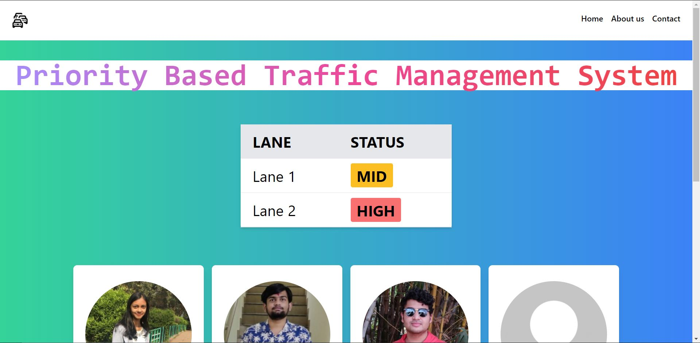
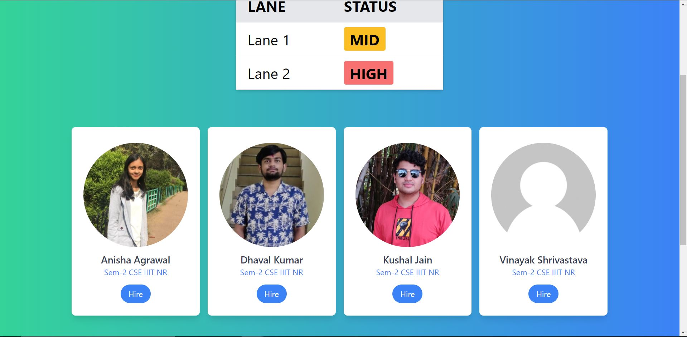

# Priority-Based-Traffic-Management-System

## WebSite

### Getting to website dir :
```bash
cd website
```

### Installing the Packages :

```bash
npm install
```

### Running the website :

```bash
node server.js
```
or
```
nodemon server.js
```

### Technologies Used :


## Our WebSite



